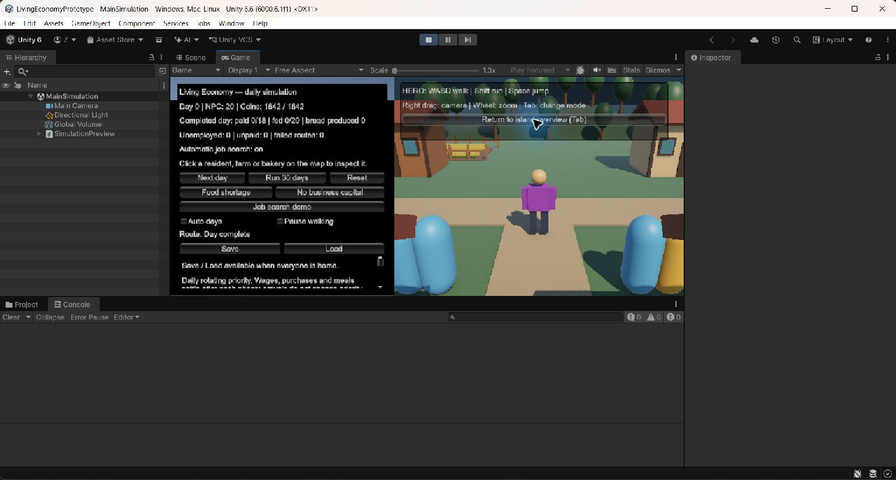
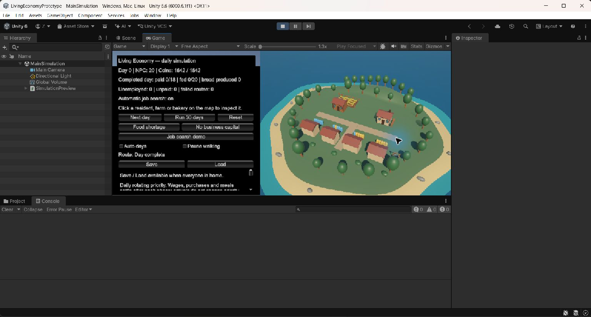

# LivingEconomyPrototype

Unity 6.6 (`6000.6.1f1`), Universal 3D. Малий острів, поселення з 20 NPC,
замкнена економіка та керований персонаж. Це робочий прототип, не завершена гра.

Основний план: [roadmap v2](Docs/ROADMAP.md), [найближчі завдання](Docs/TASKS.md).
M0, M1a (інвентар) та M1b (економіка героя) завершено; наступний підетап — M1c.
Герой і NPC використовують спільні предмети, інвентар, рахунки, потреби та команди.
Розширені survival, крафт і цивілізація
описані як заплановані системи, а не готові можливості гри.

## Запуск

Клонувати репозиторій, додати його папку до Unity Hub і відкрити потрібною версією Unity.
Відкрити `Assets/_Project/Scenes/MainSimulation.unity`, натиснути Play та клікнути Game.
Острів, будівлі, NPC й герой генеруються під час Play із коду, а не з окремих збережених префабів.

## Windows-збірка

Unity: `Living Economy > Build Windows`. Команда перевіряє, що єдиною
увімкненою сценою є MainSimulation, і створює `Builds/Windows/LivingEconomyPrototype.exe`.
Для запуску потрібна вся папка Windows разом із Data та DLL.
Це development-збірка для перевірок. Поточні результати та обмеження:
[стабілізація](Docs/STABILIZATION.md). Автоматичні тести економіки налаштовані
у `.github/workflows/simulation-checks.yml` для push і pull request.

## Керування героєм

WASD — ходьба відносно камери; Shift — біг; Space — стрибок.
Права кнопка + перетягування — камера; колесо — наближення.
E біля NPC або входу ферми/пекарні відкриває інформаційне вікно;
E/Escape закриває його. У пекарні можна купити хліб за 6 монет; у HUD — з'їсти.
Звичайний герой починає з 0 монет. Для перевірки є окремий Hero economy demo:
12 монет передає власник зі свого рахунку; виготовлено 2 реальні хліби.
Найм героя ще не реалізований. [Правила й тестовий сценарій](Docs/M1_HERO_ECONOMY.md).
Tab або кнопка над картою — перемикання героя й огляду острова.
В огляді: права кнопка обертає, середня переміщує, колесо наближає, R скидає ракурс,
ліва кнопка вибирає NPC або підприємство. Див. [керування героєм](Docs/PLAYER.md).

## Симуляція

20 NPC, ферма та пекарня; зерно → хліб → споживання. Загальна сума грошей — 1642 монети.
Є зарплати, голод, торгівля, автономний пошук доступної оплачуваної роботи,
економічні звіти та обробка недоступних маршрутів.
Next day — анімований день; Run 30 days — швидка перевірка без анімації.
Auto days повторює дні; Pause walking зупиняє маршрути; Reset та кризові сценарії
перезапускають економіку. Герой — окремий агент без автоматичної роботи,
із власним гаманцем, інвентарем і hunger/thirst; не змінює кількість 20 NPC.

Save/Load зберігає завершений економічний день у локальному XML-слоті v4
разом із гаманцем, предметами та потребами героя; читач підтримує v1/v2/v3/v4.
Перезавантаження коду відновлює завершений день, відкочуючи незавершений;
позиція героя поки не входить до збереження. Ціни й продуктивність фіксовані,
NavMesh, плавання, будівництво та соціальні системи ще не реалізовані.

## Перевірки

Потрібен .NET 10 SDK:

```powershell
dotnet run --project Simulation/Checks/Checks.csproj
```

18.09.2026: PASS, 31 134 твердження ядра, включно з 100-денними продовженнями,
збереженням грошей, атомарністю, порядком подій, наймом, звітами та XML.
Додатково PASS, 188 перевірок у Unity: реальне перезавантаження коду, карта,
камери, герой, ходьба, стрибки, стіни, взаємодії, недоступні маршрути, повторний Play та Load,
кольори посад і робочі позиції окремих підприємств, купівля/їжа та Save/Load героя.
[Результат Unity](Docs/M1B_UI_RELOAD_RESULT.txt).
Тестовий редакторський скрипт збережено в `Simulation/UnityVerification`, поза Assets;
запускати його лише в окремій копії проєкту, скопіювавши до `Assets/Editor`.

## Вигляд прототипу




## Що збережено онлайн

Assets і всі .meta, Packages, ProjectSettings, код, документація, тести та скріншоти.
Кеші Library/Temp, результати збірок і приватні локальні XML-збереження не публікуються.
GitHub зберігає джерельний проєкт: це не браузерна версія гри й не онлайн-синхронізація проходження.
